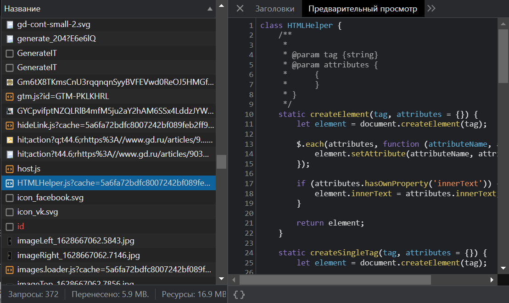
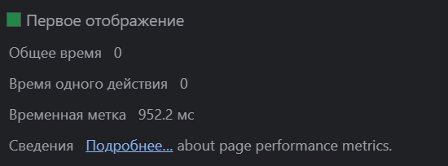

## Использование DevTools для анализа загрузки сайта

telegram для связи @geek_py

### Network
**1. На вкладке Network**
* [Записать и сохранить в HAR архив профиль загрузки ресурсов при открытии страницы](./Network/www.gd.ru.har)
### Найти неоптимальные места
1) Дублирование ресурсов
   
   
   
   
   
   
   
   

2) Лишний размер ресурса. Были выбраны файлы с лишними комментариями/большими отступами
   
   
   
   
   
   
   
   
   
   

3) Медленно загружающиеся ресурсы
   

4) Ресурсы, блокирующие загрузку
   

5) Что-то ещё (ресурсы которые упали с ошибкой)
   

1) [Записать и сохранить в файл профиль загрузки страницы](./Perfomance/Trace-20230618T015119.json)
2) Измерить время в миллисекундах от начала навигации до событий First Paint (FP), First Contentful Paint (FCP), Largest Contentful Paint (LCP), DOM Content Loaded (DCL), Load
   
   
   
   
   

3) Определить, на каком DOM-элементе происходит LCP
   

4) Измерить, сколько времени в миллисекундах тратится на разные этапы обработки документа (Loading, Scripting, Rendering, Painting)
   

### На вкладке Coverage
1) Cохранить скриншот вкладки после загрузки страницы
   

2) Измерить в килобайтах объём неиспользованного CSS в ходе загрузки страницы
   

3) Измерить в килобайтах объём неиспользованного JS в ходе загрузки страницы
   

## Дополнительное задание
**Использовать сеть Slow 3G и CPU 4x slowdown**
### Найти неоптимальные места
Slow полностью совпадает с анализом неоптимальных мест выше по тексту
1) [Записать и сохранить в HAR архив профиль загрузки ресурсов при открытии страницы](./SlowNetwork/www.gd.ru.har)
### На вкладке Performance
1) [Записать и сохранить в файл профиль загрузки страницы](./SlowNetwork/Trace-20230618T020748.json)
2) Измерить время в миллисекундах от начала навигации до событий First Paint (FP), First Contentful Paint (FCP), Largest Contentful Paint (LCP), DOM Content Loaded (DCL), Load
   
   
   
   
   
3) Определить, на каком DOM-элементе происходит LCP
   
4) Измерить, сколько времени в миллисекундах тратится на разные этапы обработки документа (Loading, Scripting, Rendering, Painting)
   

### На вкладке Coverage
1) Cохранить скриншот вкладки после загрузки страницы
   
2) Измерить в килобайтах объём неиспользованного CSS в ходе загрузки страницы
   
3) Измерить в килобайтах объём неиспользованного JS в ходе загрузки страницы
   